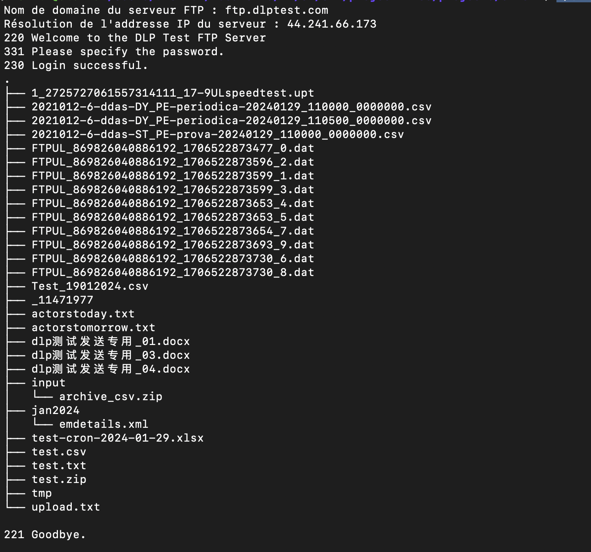

# SR1 - Projet n°1 Tree FTP

Axel LABARRE - SR1 - M1GL

## Description

### Consignes

Ce premier projet est à réaliser individuellement.\
Vous avez 3 semaines pour le réaliser.\
Pour les consignes de rendu, voir la page avec toutes les conssignes dans l'espace Moodle. Chaque semaine, et avant la séance suivante de cours, vous devrez produire un livrable hebdomadaire de votre projet en i) créant une étiquette Git de l'état courant du projet intitulée LIVRABLE_X et ii) partageant l'URL de cette étiquette via le formulaire Moodle associé à la séance (cf. livrable nºX). Les livrables intermédiaires ne donnent pas lieu à une note, mais l'absence de livrable hebdomadaire pourra être sanctionnée dans la note finale du projet.

### Énoncé

L'objectif du projet est de mettre en œuvre un commande shell permettant d'afficher sur la sortie standard d'un terminal l'arborescence d'un répertoire distant accessible via le protocole applicatif File Transfer Protocol (FTP).\
Le rendu de l'arborescence distante s'inspirera du formalisme utilisé la commande tree de Linux.

Cette nouvelle commande tree-ftp prend un argument obligatoire en paramètre:
> l'adresse du serveur FTP distant.\
> Le 2e argument—optionnel—permet d'indiquer le nom d'utilisateur à utiliser,\
> le 3e—optionnel également—correspond au mot de passe.

Il n'y a aucune autre interaction de l'utilisateur avec la commande qui est nécessaire au delà de l'exécution avec les paramètres décrits ci-dessus.

Typiquement, l'utilisateur doit uniquement indiquer :

```java
java -jar TreeFtp.jar ftp.ubuntu.com
```

Votre code affichera alors le contenu du répertoire distant de `ftp.ubuntu.com` en parcourant l'arborescence de `ftp.ubuntu.com` en profondeur d'abord.\
Pour réaliser cette commande, nous nous intéresserons donc en priorité à l'utilisation des commandes USER, PASS, LIST, CWD, CDUP de la RFC 959 (File Transfer Protocol).\

Ces commandes constituent les principales actions que l'on souhaite réaliser pour se connecter et se déplacer dans l'arborescence du serveur distant.\

C'est donc à vous d'envoyer ces commandes du standard FTP en utilisant des sockets TCP (en Java ou autre) et d'analyser les réponses transmises par le serveur FTP distant.

## Visuals



## Installation

## Utilisation

Client :

```sh
cd projects/client
make 
```

```sh
./bin/client-ftp-0.1.0 ftp.ubuntu.com
```

* Avec profondeur d'exploration (optionnel) ainsi que nom d'utilisateur et mot de passe

```sh
./bin/client-ftp-0.1.0 -L 3 ftp.dlptest.com dlpuser rNrKYTX9g7z3RgJRmxWuGHbeu
```

## Roadmap
