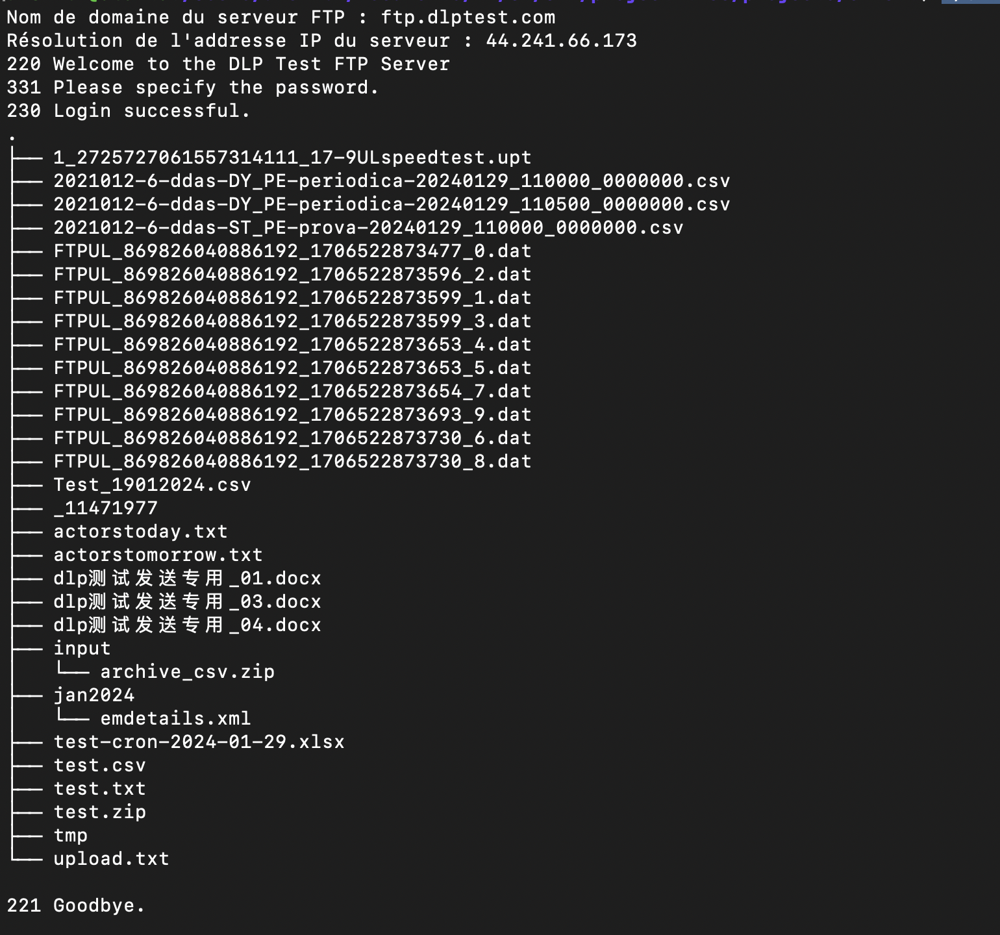
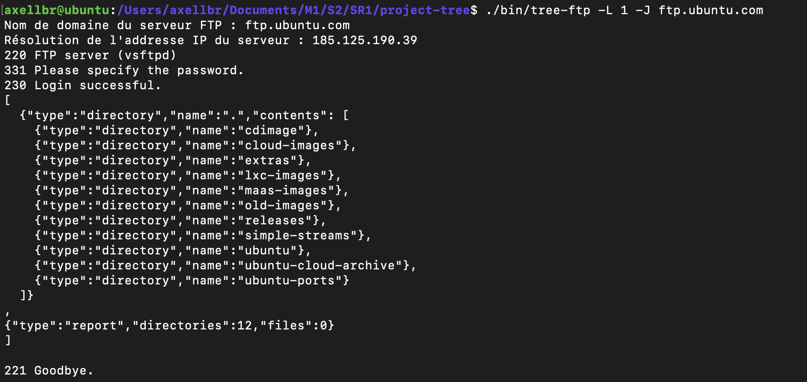

# SR1 - Projet n°1 Tree FTP

Axel LABARRE - SR1 - M1GL\
30/01/2024

## Introduction

Ce projet consiste à mettre en œuvre une commande shell permettant d'afficher sur la sortie standard d'un terminal l'arborescence d'un répertoire distant
accessible via le protocole applicatif File Transfer Protocol (FTP).
Le rendu de l'arborescence distante s'inspire du formalisme utilisé par la commande `tree` de Linux.

## Architecture

* Organisation en module
* Séparation du Code Source et des En-têtes
* Dossier de Documentation + README + Commentaires dans le code
* Tests Unitaires
* Makefile pour la Compilation
* Fichiers Exécutables et construction séparée

## Visuels

<div>
    
    
</div>
## Code Samples

#### Gestion de la ligne de commande

Ce bout de code permet de gérer les différentes options et arguments passés au programme lors de son exécution.
Quelques variables et méthodes nous sont fournies par la librairie `unistd.h` :

* `getopt()`: permet d'analyser les différentes options de la forme `-o`
* `optarg`: l'argument de l'option correspondante
* `optind`: l'index des arguments positionnels restant après analyse des options

```cpp
void CommandLineInterfaceFtpClient::ParseOptions( int argc, char* argv[] ) {
    int opt;
    while ( ( opt = getopt( argc, argv, "hL:J" ) ) != -1 ) {
        switch ( opt ) {
        case 'h':
            ShowHelp( argv[0] );
            break;
        case 'L':
            parameters_.SetExplorationDepth( std::stoi( optarg ) );
            break;
        case 'J':
            parameters_.SetIsJsonMode( true );
            break;

        // Reste du code ...
        
        }

    }
}

void CommandLineInterfaceFtpClient::ParsePosArguments( int argc, char* argv[] ) {
    if ( optind < argc ) {
        std::string addr_server_ftp = argv[optind++];
        std::string username = optind < argc ? argv[optind++] : "anonymous";
        std::string password = optind < argc ? argv[optind++] : "";
        parameters_.SetServerAddress( addr_server_ftp );
        parameters_.SetUsername( username );
        parameters_.SetPassword( password );
    }
    else {
        throw std::invalid_argument( "Usage: " + std::string( argv[0] ) + " [ftp_server_address] or -h for consult help" );
    }
}
```

#### Affichage similaire à la commande Tree

Utilisation de caractère ASCII spécifique pour les branches et d'un préfixe pour l'indentation et d'une condition pour marquer le dernier élément afin d'inclure l'indentation.

```cpp
void Tree::PrintTree() {
    std::cout << this->name_ << std::endl;

    for ( size_t i = 0; i < children_.size(); ++i ) {
        children_[i]->PrintSubTree( "", i == children_.size() - 1 );
    }

    std::cout << std::endl; 
    PrintReport();
}

void Tree::PrintSubTree( const std::string& prefix, bool is_last ) {
    std::string branch = is_last ? "└── " : "├── ";
    std::cout << prefix << branch << this->name_ << std::endl;

    // Construction du préfixe pour les enfants
    std::string child_prefix = prefix + ( is_last ? "    " : "│   " );

    for ( size_t i = 0; i < children_.size(); ++i ) {
        children_[i]->PrintSubTree( child_prefix, i == children_.size() - 1 );
    }
}
```

#### Parcours en profondeur + gestion des codes erreur FTP

Applique un parcours en profondeur de l'arbre pour ouvrir les répertoires.
Initialiser un nouveau nœud dans l'arbre en réponse à l'affichage du contenu des répertoires.
Itération sur les nœuds enfants et appel récursif du parcours en profondeur.
Gestion des exceptions via les codes erreurs FTP à l'aide d'un try-catch pour capturer l'exception et indiquer que faire.
Typiquement pour un problème d'accès à un répertoire, on ne voudrait pas interrompre le programme, mais passer au répertoire ou fichier suivant.

```cpp
void ClientFtp::DeepFirstSearch( Tree* current_tree, int depth ) {
    // Si la profondeur maximale est atteinte, retourner
    if ( depth > exploration_depth_ ) {
        return;
    }
    if ( current_tree->GetIsDir() ) {

        // Changement de répertoire
        ChangeDirectory( current_tree->GetName() );

        EnterInPassiveMode();
        ConnectToDataChannelProcess();
        ListCurrentDirectoryCommand();
        ReadResponseDataChannel();
        current_tree->InitTree( buffer_data_ );
        // Parcours des enfants
        for ( auto child : current_tree->GetChildren() ) {

            try {
                DeepFirstSearch( child, depth + 1 );
            }
            catch ( FtpException& e ) {
                if ( e.GetCodeError() == 550 ) {
                    std::cerr << "EXCEPTIONS => " << e.what() << '\n';
                    // Passe à l'élément suivant
                    continue;
                }
                else {
                    // Fermeture des sockets et libération de la mémoire
                    // Avant tentative de reconnexion
                    CloseControlSocket();
                    CloseDataSocket();

                    // Reconnexion au serveur
                    ConnectToServerProcess();
                    std::pair<int, std::string> response = ReadResponse();
                    std::cout << response.first << " " << response.second;

                    // Login
                    SendCommand( Command::USER );
                    response =  ReadResponse();
                    std::cout << response.first << " " << response.second;

                    SendCommand( Command::PASS );
                    response =  ReadResponse();
                    std::cout << response.first << " " << response.second;

                    // Changement de répertoire
                    EnterInPassiveMode();
                    ConnectToDataChannelProcess();
                    ListCurrentDirectoryCommand();
                    ReadResponseDataChannel();
                    current_tree->InitTree( buffer_data_ );
                }

            }

        }

        // Retour au répertoire parent
        BackToParentDirectory();
    }
}

```

## Utilisation

La présence d'un makefile vous permettra de build facilement ce projet

```sh
make 
```

* Consulter l'aide :

```sh
./bin/tree-ftp -h
```

* Avec utilisateur anonymous et sans mot de passe :

```sh
./bin/tree-ftp ftp.ubuntu.com
```

* Avec profondeur d'exploration (optionnel) ainsi que nom d'utilisateur et mot de passe :

```sh
./bin/tree-ftp -L 3 ftp.dlptest.com dlpuser rNrKYTX9g7z3RgJRmxWuGHbeu
```

* Affichage JSON + Profondeur :

```sh
./bin/tree-ftp -L 3 ftp.dlptest.com dlpuser rNrKYTX9g7z3RgJRmxWuGHbeu -J
```

## Roadmap

* [x] Compile et affiche la liste du répertoire distant
* [x] Le serveur FTP, le login et mot de passe peuvent être configurés en ligne de commande
* [x] Parcours d'arbre en profondeur
* [x] La profondeur d'exploration peut être configurée en ligne de commande
* [x] Affichage de l'arborescence au format Json
* [ ] Parcours en largeur
* [x] Gestion d'erreur
* [ ] Autres commandes Tree supplémentaires
